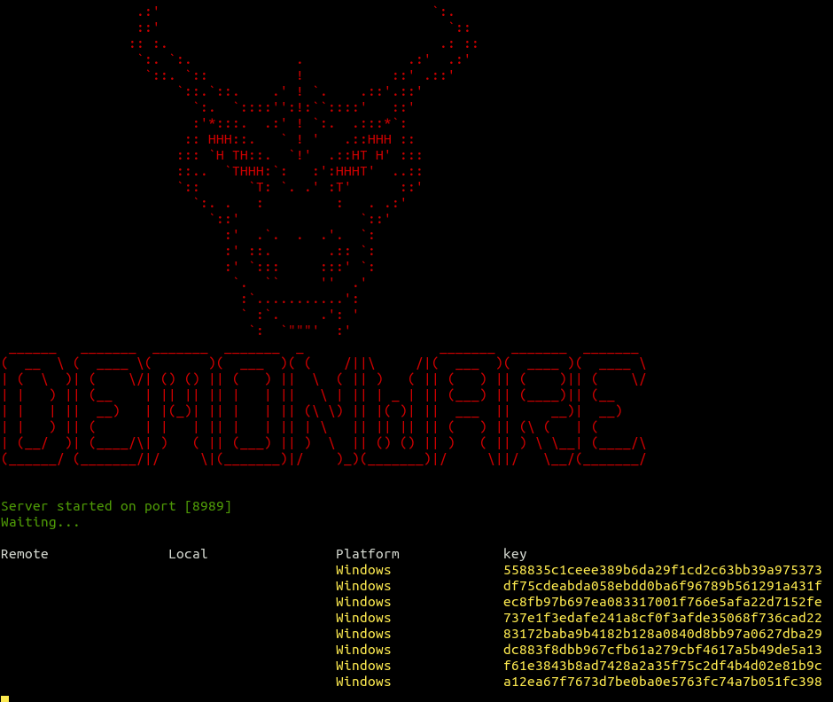
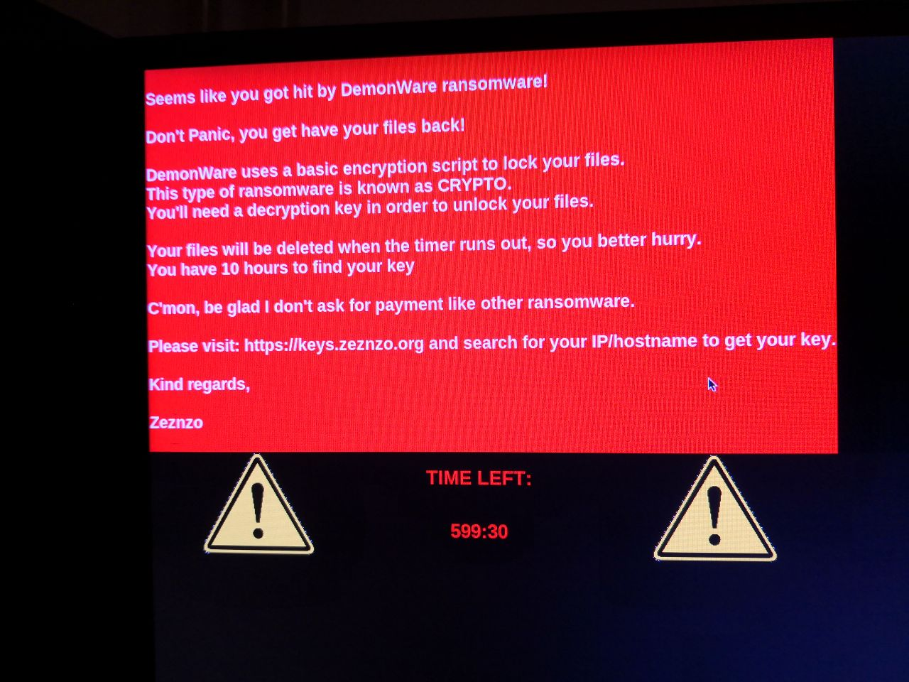

# demon
ransomware, made for a demo on ransomware awareness and how easy it is to do

Encrypt every file in your Home and send the key to a remote server

***
# Demo

***

## Works on both Windows and Linux, tested.

1. Put the remote server IP and port in "demon.py".
2. Run python server.py -p port -> Run python demon.py
3. Compile demon.py to EXE, make it a nice image or some shit and brick your Windows.
4. Anti-virusses don't give a damn, enjoy

***
